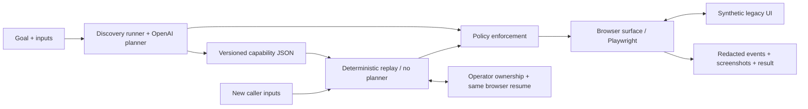

# LegacyFlow

Discover a reusable UI capability with an LLM, then replay it deterministically without an LLM.

LegacyFlow prepares a savings sub-account in a fictional credit-union servicing console and stops at **Review New Account**. It demonstrates how an exploratory run can become a typed, reviewable automation contract with policy, checkpoints, useful failures, and same-session operator intervention.



- Discovery uses compact semantic observations and schema-validated actions. Only successful, verified steps become the artifact.
- Replay resolves ordered locator bundles, validates inputs, verifies postconditions and final review, and checks the extracted deposit against the caller's amount.
- Outcomes distinguish `success`, `business_outcome`, `failure`, and `aborted`. A known notice has one deterministic recovery attempt.
- Origin, route, action, and risky-control checks run in executable code. The normal capability never creates an account.
- Operator intervention preserves the same headed browser context and page. Resume revalidates the expected screen.

## Setup

Use Python 3.13 and `uv` (validated with uv 0.12.2). Python 3.12+ is declared supported; local verification also covers replay on Python 3.14. Chromium installation needs network access. Run commands from the repository root.

```sh
git clone https://github.com/la3679/legacyflow-computer-use-automation.git
cd legacyflow-computer-use-automation
uv sync --locked --all-extras --python 3.13
uv run --no-sync python -m playwright install chromium
uv run --no-sync legacyflow version
```

On Linux, install Chromium's system dependencies with `uv run --no-sync python -m playwright install --with-deps chromium`. A headed browser needs a graphical desktop (CI uses Xvfb).

For **replay only**, use `uv sync --locked --python 3.13` without extras instead. This installation does not include OpenAI. The extra `dev` contains test tools; `discovery` contains the OpenAI SDK. Commands below use `--no-sync` to preserve your chosen environment.

No `.env` file or API key is needed for replay. For live discovery, create a local `.env` using `.env.example` as the field guide, and enter your key there privately. Never commit or paste the key into logs. Existing environment variables take precedence over `.env`.

| Variable | Default / purpose |
| --- | --- |
| `OPENAI_API_KEY` | Required only for live discovery |
| `OPENAI_MODEL` | `gpt-5.6-terra`; configurable, used by the committed genuine discovery |
| `LEGACYFLOW_BASE_URL` | `http://127.0.0.1:8000` |
| `LEGACYFLOW_OPERATOR_URL` | `http://127.0.0.1:8010` |
| `LEGACYFLOW_HEADLESS` | `false`; CLI `--headless` / `--headed` overrides it |

## Run the demo

Keep this running in one terminal:

```sh
uv run --no-sync legacyflow demo serve
```

Open [Member Search](http://127.0.0.1:8000/members) to explore the synthetic app. Use a second terminal for the following commands. Stop the server with Ctrl+C when finished.

### Replay with new inputs — no API calls

```sh
uv run --no-sync legacyflow replay evidence/capabilities/open-savings-subaccount.v1.json --input member_id=23456 --input initial_deposit=250 --headless
```

Expected: `status: success`, `member_name: Casey Example`, `initial_deposit: 250.00`, and `review_status: ready`. No account is created.

### Member not found

```sh
uv run --no-sync legacyflow replay evidence/capabilities/open-savings-subaccount.v1.json --input member_id=99999 --input initial_deposit=100 --headless
```

Expected: `status: business_outcome`, `outcome: member_not_found`, exit code 0. Failures and aborted runs use exit code 1.

### Recovery and hard failure

```sh
uv run --no-sync legacyflow replay evidence/capabilities/open-savings-subaccount.v1.json --input member_id=23456 --input initial_deposit=250 --scenario notice --headless
uv run --no-sync legacyflow replay evidence/capabilities/open-savings-subaccount.v1.json --input member_id=23456 --input initial_deposit=250 --scenario permission --headless
```

The first succeeds after dismissing one known notice. The second returns `PERMISSION_DENIED` with a step ID, expected/observed state, and screenshot reference. Also supported: `slow`, `expired`, `handoff`, and `normal`.

### Same-session operator handoff

```sh
uv run --no-sync legacyflow replay evidence/capabilities/open-savings-subaccount.v1.json --input member_id=23456 --input initial_deposit=250 --scenario handoff --headed --operator
```

1. Wait for Supervisor Confirmation in the headed target browser.
2. Open the [Operator Console](http://127.0.0.1:8010) in your browser and click **Take Control**.
3. In the **original paused target browser**, click **Confirm Review**.
4. In the console, click **Resume Automation**. Replay continues to account review. **Abort Run** terminates it instead.

Automation cannot operate while the human owns the session. Resuming on the wrong screen fails safely. Operator response is bounded to 120 seconds within a 180-second run deadline. The console is local-only, has Host/Origin checks, and is not a remote authentication service.

The committed handoff evidence uses an explicitly labeled automated demonstrator operating these controls; it does not claim a person performed the recorded run. Reproduce that automated demonstration plus notice, permission, and policy cases with:

```sh
uv run --no-sync python scripts/record_evidence.py
```

This script needs the demo server and a graphical desktop, temporarily uses operator port 8011, and saves fresh evidence under `runs/`.

### Genuine discovery — requires the discovery extra and API key

```sh
uv run --no-sync legacyflow discover --goal "Look up the supplied member, prepare a savings sub-account with the supplied initial deposit, and stop at Review New Account without creating it." --target http://127.0.0.1:8000/members --input member_id=12345 --input initial_deposit=100 --headless
```

Discovery writes `artifacts/open-savings-subaccount.v1.json`. The committed example contains nine actions from a genuine OpenAI run; fresh runs can choose a different valid action sequence. The planner uses the Responses API's [structured outputs](https://developers.openai.com/api/docs/guides/structured-outputs) with a Pydantic decision contract. Model output still passes application validation and policy before execution. Account/model access is required; API error bodies are suppressed.

## Evidence and validation

Each run prints a sanitized result and its evidence directory. `run.jsonl` records actions, locator strategies, checkpoints, recovery, and ownership; `result.json` is the structured outcome. Screenshot references are relative to that run directory. Runtime output stays ignored in `runs/` and `artifacts/`.

The committed [evidence guide](evidence/README.md) covers genuine discovery, the reusable artifact, replay success, missing member, handoff, notice recovery, permission failure, and a blocked Create Account attempt. All records are synthetic. Form inputs are masked in screenshots; fictional names and review amounts remain visible.

With all extras installed:

```sh
uv run --no-sync ruff check src tests scripts
uv run --no-sync ruff format --check src tests scripts
uv run --no-sync mypy
uv run --no-sync pytest -q
```

CI uses the committed lock file, runs offline tests with a scripted planner, and runs a separate **replay-only installation with OpenAI absent**. To run that proof locally after a replay-only install:

```sh
uv run --no-sync python scripts/check_replay_only.py
```

It starts its own temporary server and invokes the installed CLI from a directory without `.env` or API credentials. Integration tests also trap Python HTTP calls and planner imports during replay.

## Layout and boundaries

| Path | Responsibility |
| --- | --- |
| `src/legacyflow/models/` | Typed actions, observations, artifact, outcomes |
| `src/legacyflow/discovery/` | OpenAI planner, bounded loop, artifact recorder |
| `src/legacyflow/replay/` | Deterministic engine, no planner import |
| `src/legacyflow/surfaces/` | Surface protocol and guarded Playwright adapter |
| `src/legacyflow/policy/`, `config/policy.yaml` | Allowlists and redaction; select a file with `--policy` |
| `src/legacyflow/handoff/` | Ownership state, local console, resume validation |
| `src/legacyflow/demo/` | FastAPI/Jinja synthetic servicing application |
| `tests/`, `scripts/`, `evidence/` | Behavioral checks and reproducible evidence |

See [REPORT.md](REPORT.md) for design decisions and extension seams. This is one bounded web workflow: no desktop adapter, production tenant isolation, remote co-browsing, production authentication, or automatic artifact repair. Default policy permits only the local demo routes; changing the base URL also requires a reviewed policy file. Arbitrary sites and real financial data are outside this demonstration's security boundary.
